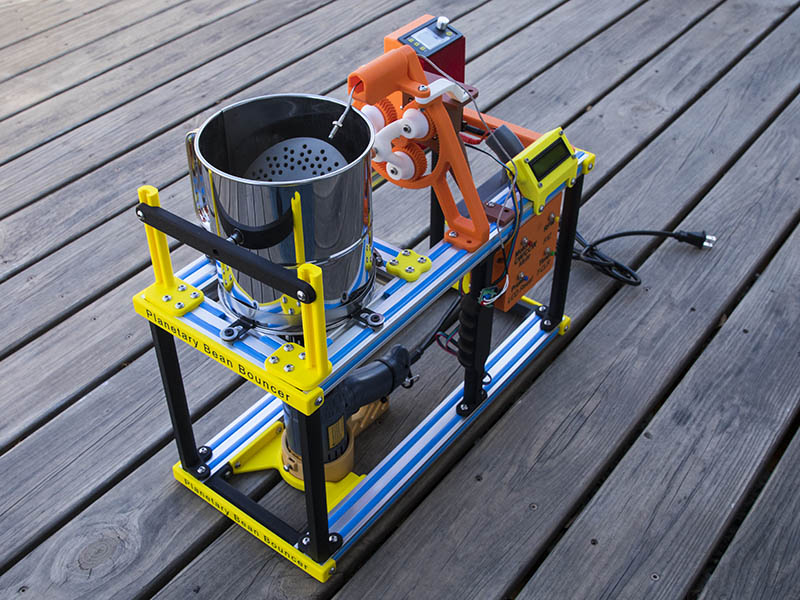

# Planetary Bean Bouncer

Open-source DIY coffee roaster project based on an 8-cup flour sifter with a
stationary heat gun and a rotating agitator, controlled by Arduino-based firmware.

> ⚠️ **Safety notice:** This project involves high heat, mains power, and moving
mechanical parts. Read `DISCLAIMER.md` before building or operating.

## Overview

The Planetary Bean Bouncer is a small-batch coffee roaster that uses a modified
flour sifter to agitate coffee beans while heat is applied from a fixed-position
heat gun. The design focuses on simplicity, accessibility, and repeatability
using commonly available components.

This repository contains the firmware, 3D-printable parts, and reference
documentation needed to build and experiment with the roaster.

## Features
- Rotating agitator driven by a stepper motor
- Stationary heat gun (no linear motion in this design)
- Arduino-based controller
- Button and LCD user interface
- Temperature sensing support (thermocouple or thermistor, depending on build)
- Configurable parameters in firmware (speed, timing, alerts)

## Project status

This project is in active development. Documentation is currently minimal
and will be expanded over time as the design evolves.

## Repository layout
- `firmware/` — Arduino firmware (MIT License)
- `hardware/` — STL files and hardware reference images (CC BY-NC 4.0)
- `wiring/` — Basic UI wiring reference (Fritzing)
- `media/` — Photos and videos

## Quick start
1. Review `hardware/README.md` for printed parts and notes
2. Review `wiring/README.md` for the basic UI wiring reference
3. Install the Arduino IDE
4. Open the firmware sketch in `firmware/`
5. Configure pins and parameters at the top of the sketch as needed
6. Upload to the Arduino and test without heat before roasting

## Hardware overview
- Controller: Arduino Uno (or compatible)
- Stepper driver: DRV8825, TMC2209, or similar (builder’s choice)
- Motor: NEMA 17 stepper motor
- Sensor: Thermocouple module (e.g., MAX6675) or thermistor
- Heat source: Consumer heat gun (stationary)

> Motor and driver wiring is intentionally not prescribed, as there are many
valid configurations depending on hardware choices.

For builders interested in fabricating their own wobble disc rather than purchasing one, a detailed fabrication guide is available here:

https://library.sweetmarias.com/wp-content/uploads/2024/09/Wobble-Disc-Coffee-Roaster-3-red-tubes-model-build-instructions.pdf

## Licensing

This project uses multiple licenses:

- **Firmware:** MIT License  
- **Hardware design files (STL, images, diagrams):**
  Creative Commons Attribution-NonCommercial 4.0 (CC BY-NC 4.0)

This allows free personal and educational use while preventing unauthorized
commercial exploitation of the hardware design.

## Support this project ☕

This project is released as open source and free to use.

If you find it useful and would like to support continued development,
documentation, and future improvements, you can:

☕ **Buy me a coffee:** https://buymeacoffee.com/geodave

Support is entirely optional, but always appreciated.

## Credits

Project design and implementation: **David Bunch**  
Firmware was developed with AI-assisted code generation and subsequently
reviewed, tested, and maintained by the author.

Some components are derived from existing open-source designs and are credited
in the relevant subdirectories.

## Build log and videos

This project has been developed and documented over time through both
videos and a long-running build log.

### YouTube playlist
A playlist documenting the design, prototyping, testing, and iterations
of the Planetary Bean Bouncer:

https://www.youtube.com/playlist?list=PLyy5iFdDEfauqgzqg_eptvup8FIkFzkNk

New videos will be added as the project continues to evolve.

### Build log
A detailed build log and discussion thread dating back to September 2025,
including design decisions, experiments, and lessons learned:

https://forum.v1e.com/t/diy-coffee-roaster/51195

These resources provide additional context beyond what is captured
in the repository files.

## Build guide

A step-by-step mechanical build guide is available in the `docs/` directory.
This guide covers frame construction, drive components, and flour sifter
integration.

Electronics integration will be documented separately.
